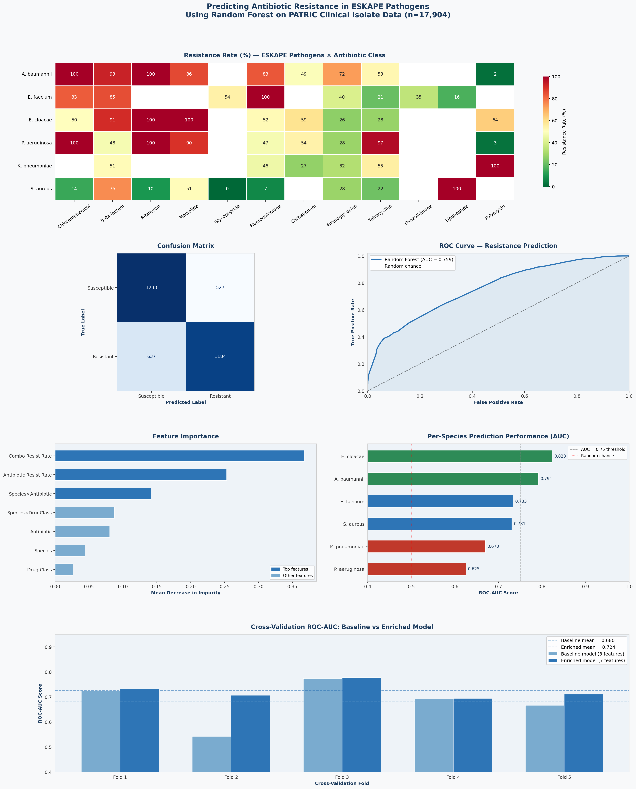

# ESKAPE AMR Resistance Predictor

**Predicting antibiotic resistance in ESKAPE pathogens using 
Random Forest classification on real clinical isolate data.**

---

## Overview

This project applies machine learning to predict antibiotic resistance 
phenotypes across all six ESKAPE pathogens — the leading cause of 
hospital-acquired infections globally. Using 17,904 phenotypic AMR 
records sourced directly from the PATRIC database (NIH), a Random Forest
classifier was trained to distinguish Resistant from Susceptible isolates 
based on species identity, antibiotic, and drug class features.

## Key Results

| Metric | Value |
|--------|-------|
| Test ROC-AUC | 0.759 |
| Cross-validated ROC-AUC | 0.724 ± 0.029 |
| Test Accuracy | 67.5% |
| Training records | 17,904 |
| Pathogens covered | 6 (all ESKAPE) |
| Drug classes | 12 |

## Main Finding

A meaningful but bounded predictive ceiling was identified using 
phenotypic features alone — termed here the **genomic feature gap**. 
Per-species AUC ranged from 0.625 (P. aeruginosa) to 0.823 
(E. cloacae), reflecting real biological differences in resistance 
mechanism consistency across the ESKAPE group.

## Visualisations

## Repository Contents

| File | Description |
|------|-------------|
| `ESKAPE_AMR_Predictor.ipynb` | Full analysis notebook (data fetch -> cleaning -> ML -> interpretation) |
| `ESKAPE_AMR_Predictor.png` | Publication-quality figure panel |

## Data Source

All AMR records are fetched live from the 
[PATRIC database](https://www.patricbrc.org/) — a free, 
NIH-funded pathogen bioinformatics resource. No static data 
files are stored in this repository; the notebook fetches 
data directly via the PATRIC API.

## Author

**Karthik Uday**  
M.Sc. Biotechnology — AI & Biomedical Data Analysis  
Vellore Institute of Technology, India
